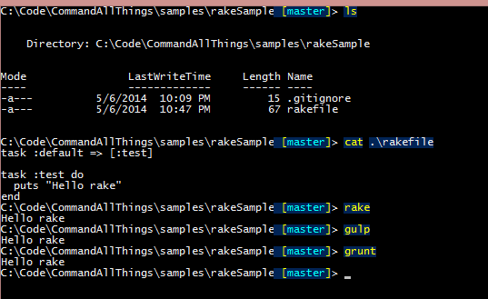

CommandAllThings
================

Wrapper around task runners like ([gulp](http://gulpjs.com/)/[grunt](http://gruntjs.com)/[rake](http://rake.rubyforge.org/)/etc...) allowing you to accidentally type the wrong starting command and still accomplish the actual task.

### Say what?

Let's say you are typing at the command prompt, working on a `nodejs` project. This project is leveraging [grunt](gruntjs.com) as it's task tool. You just worked on a project that used [gulp](http://gulpjs.com/) and happen to type `gulp test` at the command.

If you have this setup, it will re-route the `gulp test` command over and execute `grunt test` instead.

## Example:

### Get it for: [PowerShell](PowerShell/)

### Get it for: [Bash](bash/)

### Supports

| Program        | Windows           | Mac/Linux  |
| ------------- |:-------------:| -----:|
| [Ant](http://ant.apache.org/) | [TODO](https://github.com/staxmanade/CommandAllThings/issues/6) | [TODO](https://github.com/staxmanade/CommandAllThings/issues/6) |
| [Brunch](http://brunch.io/) | [TODO](https://github.com/staxmanade/CommandAllThings/issues/7) | [TODO](https://github.com/staxmanade/CommandAllThings/issues/7) |
| [Cake](http://sourceforge.net/apps/trac/cake-build) | [TODO](https://github.com/staxmanade/CommandAllThings/issues/8) | [TODO](https://github.com/staxmanade/CommandAllThings/issues/8) |
| [Fabric](http://www.fabfile.org/) | [TODO](https://github.com/staxmanade/CommandAllThings/issues/9) | [TODO](https://github.com/staxmanade/CommandAllThings/issues/9) |
| [Gradle](http://www.gradle.org/) | [TODO](https://github.com/staxmanade/CommandAllThings/issues/10) | [TODO](https://github.com/staxmanade/CommandAllThings/issues/10) |
| [GruntJS](http://gruntjs.com) | &#10003; | &#10003; |
| [GulpJS](http://gulpjs.com) | &#10003; | &#10003; |
| [Invoke-Build](https://github.com/nightroman/Invoke-Build) | &#10003; | N/A |
| [Jake](https://github.com/mde/jake) | &#10003; | &#10003; |
| [Make](http://en.wikipedia.org/wiki/Make_(software)) | TODO? | &#10003; |
| [Maven](http://maven.apache.org/) | [TODO](https://github.com/staxmanade/CommandAllThings/issues/11) | [TODO](https://github.com/staxmanade/CommandAllThings/issues/11) |
| [Rake](http://rake.rubyforge.org/) | &#10003; | &#10003; |
| [PSake](https://github.com/psake/psake) | [TODO](https://github.com/staxmanade/CommandAllThings/issues/12) | N/A |
| [Suggest another here...](https://github.com/staxmanade/CommandAllThings/issues/new) | - | - |
